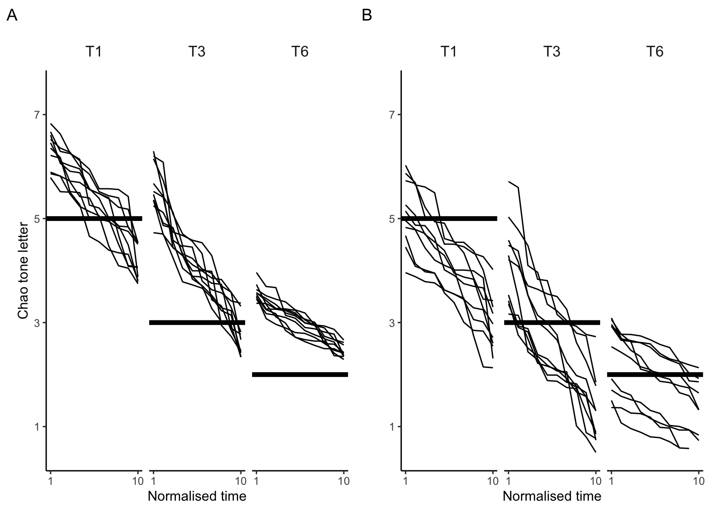

Figures for publications - here with generated data set as the original research (experimental) data is protected.

## Scatterplot with connected paired data points

Scatterplot to compare the data of two groups. Produced while developing Crosslinguistic Lexical Tasks: Cantonese version (CLT-CAN), a part of LITMUS COST IS0804 Battery (Kan et al., 2020). All participants gave numerical responses to the same set of questions. Points on the graph represent the mean value of the response for each question for each group. The two points for a given question are joint by a line that takes the colour corresponding to the group producing the higher value. Also includes code for some additional comparisons between the two groups.

## Scatterplot with LOESS curves

Scatterplot from Kan (2019): LOESS curves fitted for each response condition and data points showing individual participants' scores for each condition. The figure is created in base R (as is the original in th article). Also contains code for visualising multiple comparisons with generalised linear model and beanplot. 

## F0/Fundamental frequency of audio signals

Figure in Kan (2020) showing fundamental frequency (F0) contours of word tokens, to compare two methods for normalising F0 estimates (global in A vs local in B). Word tokens are produced in three target tones (T1, T3, and T6), sampled at 10 equidistant intervals (x-axis), and F0 estimates are converted to Chao’s tone letters (a tone notation/transcription scale) (y-axis). The horizontal lines show the conventional (theoretical) values of each tone.

## Barchart 

Code for statistical tests and barchart in Kan & Murphy (2020). 

